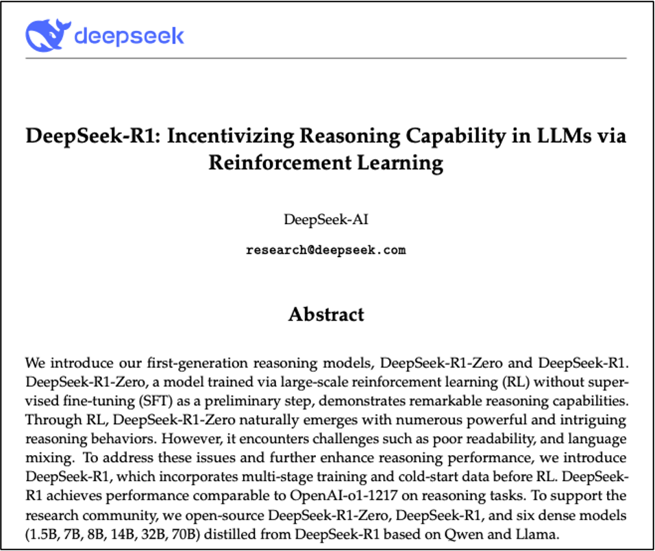
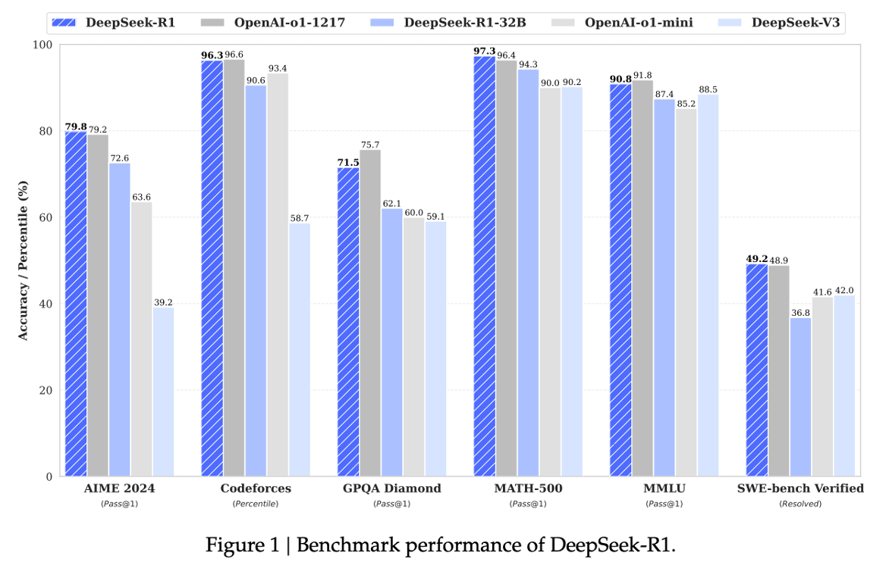
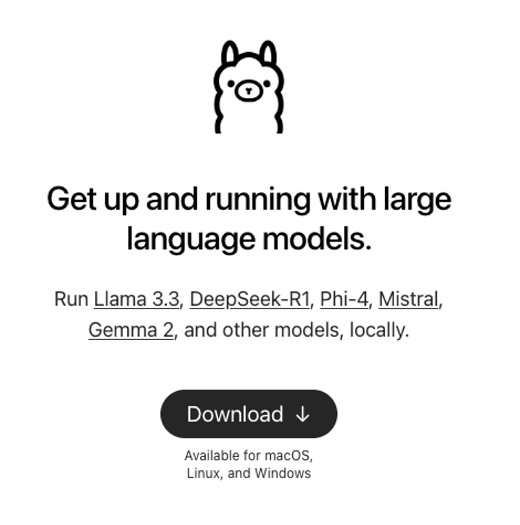
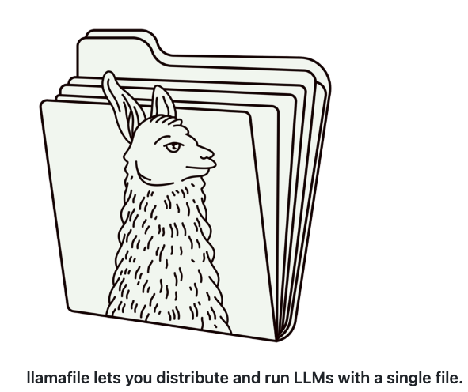

# LocalAI
A repo for experiments in building, fine-tuning, and running open-source/open-weight AI models in a local, private, and sometimes portable context.

## Overview
Running open-source/open-weight AI models ((and even proprietary models) in a local, private, and sometimes portable context offer significant advantages in security, efficiency, and accessibility. Running AI locally ensures that sensitive data stays private, reducing reliance on cloud services, and mitigating risks associated with data breaches. Running AI locally can also sometimes result in faster response times by eliminating network latency, making them ideal for real-time applications. Additionally, if the models are wrapped together with all the necessary dependencies to become truly portable, they can run on various devices, from laptops to mobile phones, enabling AI-powered solutions even in low-connectivity environments. In short, local AI gives users greater control and flexibility when working in both personal and enterprise environments regardless of whether they are online or offline.

## Advantages of Local AI
Local AI addresses several of common concerns about AI in general:

- **Fewer Hallucinations**  
  Local models can be fine-tuned on curated, domain-specific data, potentially reducing the likelihood of hallucinations and ensuring outputs align better with user intent.  

- **Increased Privacy and Consent**  
  Since data never leaves the local machine, privacy risks are minimized. Users can train models on datasets they legally own or have permission to use, avoiding ethical concerns around data scraping.  

- **Reduced Bias**  
  With full access to model weights and training data (for pre-training and/or post-training), developers can audit and modify biases rather than relying on opaque, corporate-controlled AI systems.  

- **Sustainable Deployment**  
  While training large models still requires resources, running (and potentially training) smaller, efficient models locally can be cost-effective and energy-efficient, reducing dependence on cloud computing.  

- **Improved Security**  
  Running AI in a private setting eliminates the risk of data exposure through cloud services.  

## Getting Started with Local AI

### DeepSeek-R1 and other open source/open weight models

DeepSeek-R1 is an open-source large language model designed to excel in complex reasoning tasks across various domains, including mathematics, coding, and logical inference. This makes it an excellent model to download and star experiment with in a local context. You can read a paper describing the model [here](https://arxiv.org/pdf/2405.04434)


  

Key features include:

- **Reinforcement Learning-Based Training**: Utilizes large-scale reinforcement learning to develop advanced reasoning capabilities, further enhanced through supervised fine-tuning for improved readability and coherence.

- **High Performance in Reasoning Benchmarks**: Demonstrates state-of-the-art results in various benchmarks, showcasing proficiency in logical inference, chain-of-thought reasoning, and real-time decision-making.

  

- **Open-Weight Accessibility**: Released under the MIT license, allowing full transparency and customization, enabling the community to leverage model weights and outputs for fine-tuning and distillation.  

- **Cost-Effective Operation**: Developed at a fraction of the cost compared to other models, utilizing fewer chips and energy, challenging the traditional approach of expensive and energy-intensive AI infrastructures.  


In the sections below, DeepSeek-R1 will be used as an example, but the steps should be repeatable with any other open-source/open-weight model.

### Using Hugging Face to learn about the latest open-source/open-weight models
[Hugging Face](https://huggingface.co/) is a leading platform for exploring, developing, and sharing open-source AI models. It provides a vast repository of pre-trained models across various domains, including natural language processing, computer vision, and audio processing. By browsing the [**Models**](https://huggingface.co/models) hub, you can find the latest open-weight models and compare their performance. The platform also offers [**datasets**](https://huggingface.co/datasets) and other resources, making it an essential resource for researchers, developers, and AI enthusiasts. 
https://huggingface.co/models

  

In theory, you can also use Hugging Face libraries to download and run AI models locally. However, beginners to local AI are likely to find this challenging for two main reasons:
- **Information on model sizes is not immediately clear**<br>
  This means that you may attempt to download a model that is too big to fit into the RAM of your local computer and will not work.

- **Code to run the models locally can be out-of-date**<br>
This means that when you attempt to download and run the model, the code throws an error or doesn't produce any output.

    Here is example code to run models provided by Hugging face locally

    ```bash
        from llama_cpp import Llama
        llm = Llama.from_pretrained(
            # repo_id="QuantFactory/Dolphin3.0-Llama3.2-1B-GGUF",
            # filename="Dolphin3.0-Llama3.2-1B.Q2_K.gguf",
            repo_id="unsloth/DeepSeek-R1-Distill-Qwen-1.5B-GGUF",
            filename="DeepSeek-R1-Distill-Qwen-1.5B-Q2_K.gguf",
        )

        # Define conversation messages in chat format
        messages = [
            {"role": "system", "content": "You are a helpful assistant."},
            {"role": "user", "content": "What is the capital of France?"}
        ]

        # Generate response
        response = llm.create_chat_completion(messages=messages)

        # Print the model's reply
        print(response["choices"][0]["message"]["content"])

    ```
    
The solution is to use a more user-friendly interface to locate, download, and run AI models.

### Using LM Studio to discover, download, and run local LLMs

LM Studio is a powerful desktop application that allows users to run and experiment with large language models (LLMs) locally. It provides an intuitive interface for downloading, managing, and running open-weight models without requiring complex setup. Key features include **built-in model discovery**, **one-click downloads**, and **GPU acceleration support** for optimized performance. LM Studio also offers a **chat interface** for interacting with models and supports **customizable prompts** and parameters, making it ideal for both casual users and developers.

  

- **Step 1**
  Use the "Search" tab to display the "Mission Control" window, where you can search for a model and download it. Trending models will be listed and models that are likely to not fit on your local computer hardware will be flagged.

  

- **Step 2**
  In the "Chat" tab, select the model at the top of the screen, type your prompt and begin chatting with the model!

  

- **Optional steps 1**
  Use the experimental Retrieval Augmented Generation (RAG) feature to add content from files into the context window of the model to query it.

  


- **Optional steps 2**
  LMStudio automatically starts a local server that serves the model. This allows you to use a standard script to interact with the model through API calls.

    ```bash
    import requests
    import json

    # Define the API endpoint (check LMStudio settings for the correct port)
    API_URL = "http://localhost:1234/v1/completions"

    # Define the request payload with streaming enabled
    payload = {
        "model": "lmstudio-community/deepseek-r1-distill-llama-8b",
        "prompt": "What is the capital of France?",
        "temperature": 0.6,
        "stream": True  # Enable streaming
    }

    # Send the request with stream=True
    response = requests.post(API_URL, json=payload, stream=True)

    # Check if the request was successful
    if response.status_code == 200:
        print("Response:")
        for line in response.iter_lines():
            if line:
                # Decode the line and parse JSON
                decoded_line = line.decode("utf-8")
                # Streaming responses start with 'data: '
                if decoded_line.startswith("data: "):
                    decoded_line = decoded_line[6:]  # Remove 'data: ' prefix
                try:
                    json_data = json.loads(decoded_line)
                    print(json_data.get("choices", [{}])[
                          0].get("text", ""), end="", flush=True)
                except json.JSONDecodeError:
                    pass  # Ignore invalid JSON lines
    else:
        print("Error:", response.status_code, response.text)
  ```

### Using Ollama to get up and running with large language models

Ollama is a versatile tool that enables users to run and experiment with large language models (LLMs) locally. It offers a straightforward command-line interface for downloading, managing, and interacting with open-weight models without complex setups. Key features include **model discovery**, **simple model downloads**, and **customizable system prompts** to tailor model behavior. Ollama is suitable for both casual users and developers seeking to explore LLMs on their local machines.

  

- **Step 1**  
  Download and install Ollama from the [official website](https://ollama.com/). Choose the installer that matches your operating system—macOS, Linux, or Windows. After installation, open your command-line interface (CLI).

- **Step 2**  
  Find available models through the "Models" section of the Ollama website, where you can search for a model or choose one of the trending models that are listed.

    

- **Step 3**  
  Click on the model card to see details of the model. Here, you can also select which version of the model you want to download and run locally on your computer, and copy the exact command to paste into your local command line inteface (CLI)  (see Step 4) to get things working.

    

- **Step 4**  
  In your command line inteface (CLI) (CMD.exe on Windows or Terminal on MacOS), automatically pull the desired model from Hugging Face (if it's not already downloaded) and run the model, by executing the command:

  ```bash
  ollama run [model_name]
  ```

  Replace [model_name] with the specific model you wish to download, such as deekseek-R1:8b. This command downloads the model onto your machine.

  ```bash
  ollama run deekseek-R1:8b
  ```

  This will start an interactive session where you can input prompts and receive responses from the model.
  
    

- **Step 3**  

  To exit the session, type /bye.

    ```bash
    > /bye
    ```

- **Optional steps 1**
  Ollama automatically starts a local server that serves the model. This allows you to use a standard script to interact with the model through API calls. 

    ```bash
      import ollama


      def main():
          # model = "llama3.2"
          model = "deepseek-r1:8b"
          # model = "pirate_demo"
          # model = "pirate_demo_deepseek"

          prompt = "What is the capital of France?"
          # Stream the response
          for chunk in ollama.chat(model=model, messages=[{"role": "user", "content": prompt}], stream=True):
              print(chunk["message"]["content"], end="", flush=True)

          print()  # Newline after response


      if __name__ == "__main__":
          main()
    ```

  Notice that the script above utilizes the ollama python library, which greatly simplifies the code needed.

## Making local AI models portable
The methods above allow you to run LLMs locally, but they rely on applications like LLMStudio and Ollama. Sometimes it is useful to run LLMs in a completely portable manner, with all scripts, dependencies, and even the LLM itself wrapped into a single file executable that can be distributed to others giving them a one click solution. 

### What is Llamafile?

Llamafile is an open-source framework that packages open-weight LLMs into standalone executable files. These “llamafiles” are designed to run on multiple operating systems and hardware configurations without modification, making LLMs more accessible to a broader audience.

The main Llamafile packaging tool can also be used to load and run existing local LLMs, providing an extremely lightweight, portable LLM distribution framework that can be used to build full-stack portable AI applications.

This approach simplifies the process of sharing and running models across various systems without the need for complex setups or installations.


  

### How to use Llamafile with LLM model weights included

To run the a 'llamafile' locally with LLM model weights included, follow these steps:

1. **Download the Llamafile**

   Download one of the pre-packaged 'lamafile' examples, e.g.,  [llava-v1.5-7b-q4.llamafile](https://huggingface.co/Mozilla/llava-v1.5-7b-llamafile/resolve/main/llava-v1.5-7b-q4.llamafile?download=true) (4.29 GB) from the [official repository](https://huggingface.co/Mozilla/llava-v1.5-7b-llamafile/blob/main/llava-v1.5-7b-q4.llamafile).

2. **Prepare the File for Execution**

   - **For macOS, Linux, or BSD Users:**

     Open your terminal, navigate to the directory containing the downloaded file, and grant execution permissions:

     ```bash
     chmod +x llava-v1.5-7b-q4.llamafile
     ```

   - **For Windows Users:**

     Rename the file to add the `.exe` extension:

     ```bash
      llava-v1.5-7b-q4.llamafile.exe
     ```

3. **Run the Llamafile**

   Execute the file from your terminal:

   - **macOS, Linux:**

     ```bash
     ./llava-v1.5-7b-q4.llamafile
     ```

   - **Windows:**
     ```cmd
     llava-v1.5-7b-q4.llamafile.exe
     ```

   Upon execution, a chat interface will appear in the terminal that you can use to interact with the model.


   At the same time, a local web server will start, and your default browser should open automatically, displaying a chat interface that you can use to interact with the model. If it doesn't, manually open your browser and navigate to `http://localhost:8080`.

  

4. **Terminate the Session**

   When you're finished, return to your terminal and press `Ctrl+C` (Win/Linux) or `Cmd+C` (MacOS) to stop the Llamafile server.


### How to use Llamafile with a separately downloaded LLM

To use Llamafile with a separately downloaded LLM, follow these steps:

1. **Download the Llamafile engine**

   Download the latest version of Llamafile, e.g.,  [llamafile 0.9.0](https://github.com/Mozilla-Ocho/llamafile/releases/download/0.9.0/llamafile-0.9.0) (231 MB) from the [official repository](https://github.com/Mozilla-Ocho/llamafile/releases/).

2. **Prepare the File for Execution**

   - **For macOS, Linux, or BSD Users:**

     Open your terminal, navigate to the directory containing the downloaded file, and grant execution permissions:

     ```bash
     chmod +x llamafile-0.9.0
     ```

   - **For Windows Users:**

     Rename the file to add the `.exe` extension:

     ```bash
      llamafile-0.9.0.exe
     ```

3. **Run Llamafile with a local model**

   Execute the Llamafile engine from your terminal specifying the path to your local model using the -m flag. Once convenient way to get the path to the model is through the Model browser of LMStudio:

   - **macOS, Linux:**

     ```bash
     ./llamafile-0.9.0 -m YOUR_MODEL
     ```

     e.g.,

     ```bash
      % ./llamafile-0.9.0 -m /Users/laurenceanthony/.cache/lm-studio/models/lmstudio-community/DeepSeek-R1-Distill-Llama-8B-GGUF/DeepSeek-R1-Distill-Llama-8B-Q4_K_M.gguf

     ```


   - **Windows:**
     ```cmd
      llamafile-0.9.0.exe -m YOUR_MODEL
     ```

     e.g.,

     ```cmd
     % ./llamafile-0.9.0.exe -m /Users/laurenceanthony/.cache/lm-studio/models/lmstudio-community/DeepSeek-R1-Distill-Llama-8B-GGUF/DeepSeek-R1-Distill-Llama-8B-Q4_K_M.gguf
     ```


   Upon execution, a chat interface will appear in the terminal that you can use to interact with the model.


   As before, at the same time, a local web server will start, and your default browser should open automatically, displaying a chat interface that you can use to interact with the model. If it doesn't, manually open your browser and navigate to `http://localhost:8080`.

4. **Terminate the Session**

   When you're finished, return to your terminal and press `Ctrl+C` (Win/Linux) or `Cmd+C` (MacOS) to stop the Llamafile server.

By streamlining the distribution and execution of LLMs, Llamafile enhances the portability of local AI models, making them more accessible and easier to deploy across diverse environments.


